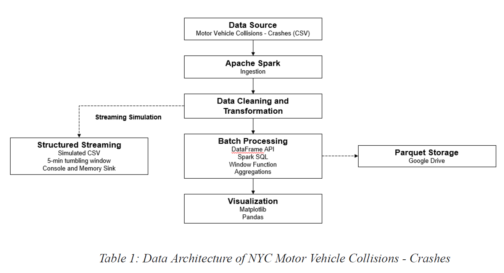

# Scalable Processing of NYC Motor Vehicle Collision Data

An end-to-end Big Data pipeline built with **Apache Spark** to analyze over 2.25 million NYC traffic collision records. The project combines batch processing, Spark SQL, window functions, and structured streaming to uncover traffic safety patterns across New York City's five boroughs.

---

## Project Overview

| | |
|---|---|
| **Goal** | Identify high-risk locations, peak collision times, and primary contributing factors using scalable Big Data tools |
| **Dataset** | NYC Motor Vehicle Collisions - Crashes (NYC OpenData) - 2.25M records, 2012–2025 |
| **Pipeline** | Batch Processing + Spark Structured Streaming |
| **Framework** | Apache Spark 3.5.0 (PySpark) on Google Colab |

---

## Dataset

| Property | Detail |
|---|---|
| **Name** | Motor Vehicle Collisions - Crashes |
| **Source** | [NYC OpenData](https://data.cityofnewyork.us/Public-Safety/Motor-Vehicle-Collisions-Crashes/h9gi-nx95/about_data) |
| **File** | Motor_Vehicle_Collisions_-_Crashes_20260310.csv |
| **Size** | ~549 MB — 2,247,389 rows × 29 columns |
| **Key Fields** | CRASH DATE, BOROUGH, CONTRIBUTING FACTOR, NUMBER OF PERSONS INJURED, LATITUDE/LONGITUDE |

---

## Tech Stack & Architecture

- **Apache Spark (Core & DataFrames)** - Large-scale data ingestion, schema inference, and cleaning
- **Spark Structured Streaming** - Simulated real-time collision feed for emergency response monitoring
- **Spark SQL** - Time, factor, and vehicle type analysis using UNION ALL across 5 vehicle columns
- **Window Functions** - Year-over-year crash count change per borough using `lag()`
- **Python (PySpark)** - Primary programming language
- **Google Colab + Google Drive** - Cloud execution environment and Parquet storage
- **Matplotlib & Pandas** - Visualization

**Data Architecture:**



---

## Methodology

### Part 1 - Batch Processing

**Load & Inspect**
- Loaded 2,247,389 rows with schema inference
- Identified null distributions across all 29 columns

**Data Cleaning & Preprocessing**

| Step | Detail |
|---|---|
| Drop redundant columns | Removed `CROSS STREET NAME`, `OFF STREET NAME`, `LOCATION` (concatenation of lat/long) |
| Timestamp creation | Merged `CRASH DATE` + `CRASH TIME` into a single `CRASH_TIMESTAMP` column |
| Type casting | Injury/kill counts cast to `IntegerType` |
| Null removal | Dropped rows with nulls in `CRASH_TIMESTAMP`, `BOROUGH`, `NUMBER OF PERSONS INJURED` |
| Invalid record filtering | Removed negative injury counts and years outside 2012–2025 |
| **Result** | 2,247,389 → **1,550,033 clean records** (697,356 removed) |

**Data Analysis - Three Approaches**

| Method | Questions Answered |
|---|---|
| DataFrame API | High-risk boroughs, fatal crash distributions, average injury rates |
| Spark SQL + UNION ALL | Peak crash hours, top contributing factors across all 5 vehicle columns, borough-hour combinations |
| Window Functions (`lag()`) | Year-over-year crash count change per borough |

### Part 2 - Structured Streaming

- Cleaned data was sampled and split into 5 mini-batch CSV files simulating a live feed
- Streaming query grouped records into **5-minute tumbling windows** per borough
- Results output to both **console sink** and **memory sink**
- Aggregated results saved as **Parquet files** to Google Drive

### Part 3 - Visualization

Four main charts + three appendix charts produced using Matplotlib.

---

## Results

### High-Risk Locations


| Borough | Total Crashes | Fatal Crashes | Avg Injuries/Crash |
|---|---|---|---|
| **Brooklyn** | **497,094** | **706** | 0.35 |
| Queens | 415,325 | 563 | 0.32 |
| Manhattan | 343,176 | 376 | 0.23 |
| Bronx | 229,544 | 313 | 0.35 |
| Staten Island | 64,894 | 104 | 0.30 |

> Brooklyn leads in total crashes and fatalities. However, injury rates are **relatively uniform across all boroughs** (20–30%), suggesting crash severity is not significantly tied to location.

### Trends Over Time (2012–2025)


| Year | Crashes |
|---|---|
| 2012 | 77,576 |
| 2013 | 155,981 |
| 2014 | 156,356 |
| **2015** | **163,474** ← Peak |
| 2020 | 73,688 ← COVID drop |
| 2024 | 65,230 |
| 2025 | 68,498 |

> Crash counts peaked in **2015** before declining. The **2020 COVID-19 lockdowns** caused the sharpest single-year drop across all boroughs (Queens: −19,198; Brooklyn: −19,007; Manhattan: −15,738). Post-pandemic levels remain significantly lower, with a gradual upward trend emerging in 2024–2025.

### Peak Hours & Location Combinations


| Crash Hour | Crash Count |
|---|---|
| **16 (4 PM)** | **110,921** ← Highest |
| 17 (5 PM) | 108,300 |
| 14 (2 PM) | 104,296 |
| 15 (3 PM) | 96,705 |
| 0 (midnight) | 49,319 |

**Top Borough + Hour Combinations:**

| Borough | Hour | Crash Count |
|---|---|---|
| Brooklyn | 16 | 36,239 |
| Brooklyn | 17 | 35,414 |
| Brooklyn | 14 | 33,567 |
| Queens | 17 | 29,548 |
| Queens | 16 | 29,253 |

> Crashes peak between **2–6 PM** (afternoon rush hour). Brooklyn during rush hours is the single highest-risk combination.

### Contributing Factors & Vehicle Types


| Factor | Crash Count |
|---|---|
| **Driver Inattention/Distraction** | **372,902** |
| Failure to Yield Right-of-Way | 112,738 |
| Other Vehicular | 77,964 |
| Backing Unsafely | 70,761 |
| Following Too Closely | 61,587 |
| Passing or Lane Usage Improper | 49,070 |
| Passing Too Closely | 48,037 |
| Turning Improperly | 43,549 |
| Traffic Control Disregarded | 34,825 |
| Fatigued/Drowsy | 32,159 |

**Top Vehicle Types Involved:**

Sedan (744,630) → Station Wagon/SUV (583,999) → Passenger Vehicle (567,033) → Sport Utility/Station Wagon (248,208) → Taxi (65,520)

> Using only Vehicle 1 would have **undercounted** contributing factors — many multi-vehicle crashes record the primary cause in Vehicles 2–5. UNION ALL across all 5 vehicle columns was essential for accurate results.

### Streaming Simulation Results

| Borough | Total Crashes (All Windows) | Total Injured |
|---|---|---|
| **Brooklyn** | **199,294** | 69,822 |
| Queens | 166,687 | 52,962 |
| Manhattan | 136,945 | 31,420 |
| Bronx | 92,028 | 32,207 |
| Staten Island | 25,945 | 8,021 |

> Streaming results are **fully consistent** with batch findings — Brooklyn leads across all 5-minute windows, concentrated in afternoon/evening hours. This confirms Spark Structured Streaming as a viable foundation for real-time emergency response dispatch.

---

## Key Findings

**1. Brooklyn is the highest-risk borough** by total crash volume (497,094) and fatality count (706), consistent with its population density. However, crash severity is uniform across boroughs.

**2. Driver inattention dominates** as the leading contributing factor (372,902 crashes) — nearly 3× the second-ranked factor, reinforcing the importance of distracted driving campaigns.

**3. The 2020 COVID drop was the largest single-year change** across all boroughs, with post-pandemic levels remaining ~40% below 2015 peaks. The gradual upward trend in 2024–2025 warrants continued monitoring.

**4. Afternoon rush hour (2–6 PM) is the highest-risk window**, with Brooklyn at 4 PM being the single highest-risk borough-hour combination.

**5. Batch and streaming results were fully consistent**, validating the pipeline architecture.

---

## Limitations & Future Work

**Data Quality Limitations:**
- ~30–40% of rows had null Borough values, limiting location-based completeness. Recommended fix: automatically derive borough from GPS coordinates to eliminate manual entry gaps
- High proportion of "Other Vehicular" contributing factors reduces precision of factor analysis

**Future Enhancements:**
- Replace simulated CSV batches with **real-time Kafka streaming** for production deployment
- Apply **spatial analysis** using official borough boundaries to recover null-Borough records
- Enrich dataset with **weather conditions and city events** for causal context
- Deploy as a production-ready **traffic safety monitoring system** for urban planners

---

## Setup & Usage

```bash
# Clone the repository
git clone https://github.com/ReneeRaeSC/NYC-Motor-Vehicle-Collision-Analysis.git
cd NYC-Motor-Vehicle-Collision-Analysis

# Install dependencies
pip install -r requirements.txt

# Run the notebook
jupyter notebook Scalable_Processing_of_NYC_Motor_Vehicle_Collision_Data.ipynb
```

> **Note:** This project requires Java (OpenJDK 17) and PySpark 3.5.0. The notebook was developed on Google Colab with the dataset stored in Google Drive.

---

## Repository Structure

```
nyc-collision-analysis/
│
├── README.md
├── Scalable_Processing_of_NYC_Motor_Vehicle_Collision_Data.ipynb
├── requirements.txt
├── Total_Crashes_by_Borough.png
├── Yearly_Crash_Trend.png
├── Crashes_by_hour_of_day.png
├── Top_10_Contributing_Factors.png
├── Average_Injuries_per_Crash_by_Borough.png
├── Fatal_Crashes_per_Borough.png
└── Year_over_year_Crash_Count_Change_by_Borough.png
└── data_architecture.png
```

---

## References

- NYC OpenData. (2026). *Motor Vehicle Collisions - Crashes* [Dataset]. City of New York. https://data.cityofnewyork.us/Public-Safety/Motor-Vehicle-Collisions-Crashes/h9gi-nx95/about_data
